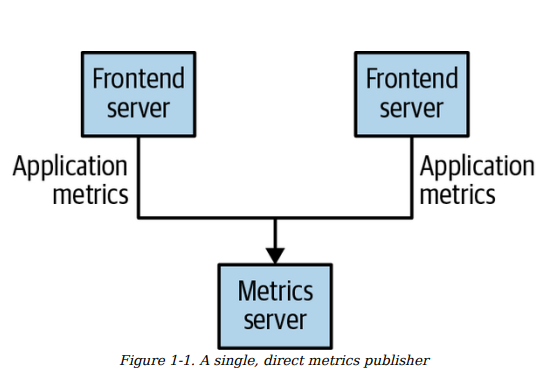
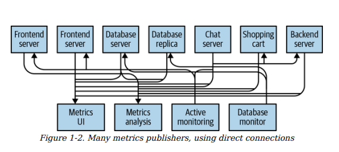
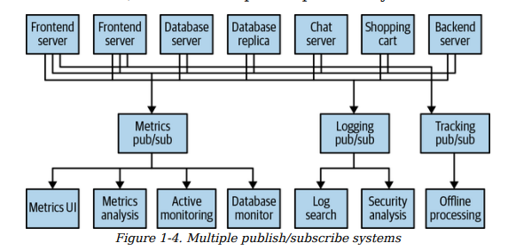
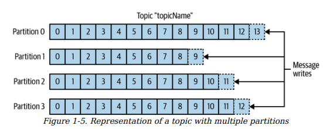
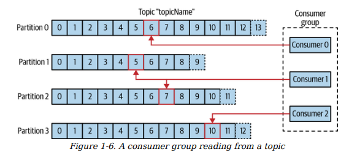
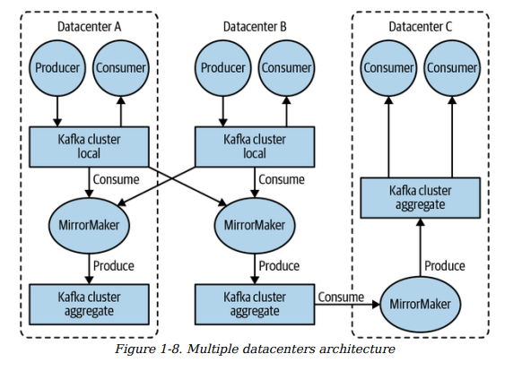
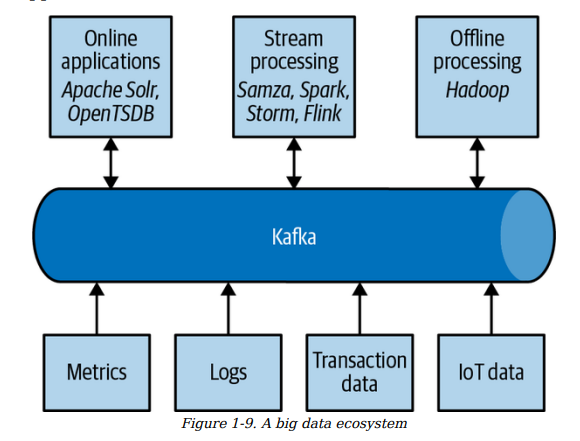

# Kafka: The Definitive Guide – Chapter 1 Summary
**Meet Kafka**  
(Complete summary of Chapter 1 – 2nd Edition)

## Overview

This README summarizes **Chapter 1** of *Kafka: The Definitive Guide* (typically 2nd or 3rd edition).  
The chapter explains why data movement is critical, how organizations evolve toward pub/sub messaging, why traditional approaches fail at scale, and how **Apache Kafka** solves these problems as a durable, distributed streaming platform.

## 1. Data – The Lifeblood of Every Enterprise

**Core Idea**  
Every organization runs on data: it is ingested, analyzed, transformed, and produces more output.

**Key Points**
- Applications constantly generate data: logs, metrics, user actions, messages, etc.
- Each byte has value and should drive decisions.
- Faster, reliable data movement = more agile business.
- Efficient pipelines free teams to focus on core value.

**Example**  
Amazon: user clicks → personalized recommendations minutes later  
→ Speed of data pipelines = competitive edge.

**Conclusion**  
Data pipelines are now as strategically important as the data itself.

## 2. Publish/Subscribe Messaging (Pub/Sub) Pattern

**Definition**  
Publishers send messages without targeting specific receivers → subscribers register interest in message types/classes.

**Core Characteristics**
- Loose coupling between senders and receivers
- Messages tagged/classified (topics/categories/keys)
- Central broker handles distribution

**Benefits**
- Add consumers without changing producers
- Natural horizontal scaling
- Improved maintainability and fault isolation

## 3. How Pub/Sub Emerges Organically (Metrics Example)

Organizations start simple and evolve into pub/sub due to pain:

| Stage | Description                                      | Style                  | Main Problems                              |
|-------|--------------------------------------------------|------------------------|--------------------------------------------|
| 1     | One app → direct → dashboard                     | Point-to-point         | Only works small-scale                     |
| 2     | Add analytics → write to multiple endpoints      | Multiple direct links  | Producers know all consumers               |
| 3     | Many apps + polling → spaghetti connections      | N×M messy connections  | Hard to trace, maintain, secure            |
| 4     | Central hub collects & serves all                | Central pub/sub broker | Clean → you just built pub/sub!            |

**Figures (descriptions – replace with real images if available)**

- **Figure 1-1**: Single producer → single direct consumer (simple start)
- **Figure 1-2**: Many producers → multiple consumers → chaotic point-to-point connections
- **Figure 1-3**: Many producers → one central broker → many consumers (clean pub/sub)

## 4. The Problem of Multiple Separate Queue Systems

Different teams build separate pub/sub for metrics, logs, user events → duplication explosion.

**Figure 1-4** (described):  
Three isolated pub/sub systems — each with own producers, consumers, code, bugs, ops.

**Problems**

| Issue                          | Impact                                                                 |
|--------------------------------|------------------------------------------------------------------------|
| Duplication                    | Same logic (queuing, retry, monitoring) built 3×                       |
| High maintenance               | Separate bugs, scaling limits, teams                                   |
| Inconsistent tech              | RabbitMQ here, something else there                                    |
| New use cases painful          | Build new system or overload existing?                                 |
| Doesn't scale with business    | More data/use cases → more systems → worse complexity                  |

**Desired State**  
One unified, generic, scalable messaging platform → enter **Kafka**.

## 5. Enter Kafka – The Distributed Commit Log

**Core Idea**  
Kafka provides one durable, ordered, scalable, distributed log for any data stream.

**Commit Log Analogy**
- Traditional logs: durable, ordered, replayable transactions.
- Kafka: same at massive scale → durable storage, strict order, deterministic reads, distributed/fault-tolerant.

## 6. Kafka Core Concepts

### Messages & Keys
- Message = byte array (Kafka is format-agnostic)
- Optional **key** → hash → consistent partition (order per key)

### Batches
- Messages sent in batches → higher throughput
- Trade-off: size vs. latency
- Usually compressed

### Schemas (Recommended)
- Use Avro (compact, schema evolution, backward/forward compatible)
- Decouples producers/consumers
- Central Schema Registry

### Topics & Partitions
- **Topic** = category (like table/folder)
- **Partition** = append-only log (order guaranteed per partition)
- **Figure 1-5**: Topic with 4 partitions (append to end)

### Scalability & Fault Tolerance
- More partitions → more servers → horizontal scale
- Replication → survive broker failures

### Producers & Consumers
- **Producers**: write to topics (key-based or custom partitioning)
- **Consumers**: read in order, track offsets
- **Consumer Groups**: load-balance partitions, auto-rebalance on failure
- **Figure 1-6**: Group with 3 consumers owning 4 partitions

### Brokers & Clusters
- **Broker** = single server
- **Cluster** = multiple brokers + controller
- **Figure 1-7**: Partition with leader + followers (replication)

### Retention
- Durable storage (time- or size-based)
- Log compaction: keep latest per key (changelog pattern)

### Multiple Clusters & MirrorMaker
- Reasons: geo-distribution, isolation, DR
- **MirrorMaker**: replicate between clusters
- **Figure 1-8**: Aggregation + cross-DC mirroring

**Figure 1-9**: Kafka as central nervous system of big data ecosystem

## 7. Why Kafka Wins (vs. Traditional Queues)

| Feature                  | Kafka Strength                                      | Traditional Queues Limitation                     |
|--------------------------|-----------------------------------------------------|---------------------------------------------------|
| Multiple Producers       | Easy aggregation from many sources                  | Harder to consolidate cleanly                     |
| Multiple Consumers       | Fan-out without interference                        | Message usually consumed once                     |
| Disk Retention           | Long-lived, replayable data                         | Short-lived or in-memory                          |
| No Backpressure Risk     | Consumers can lag safely                            | Risk of loss or overflow                          |
| Scalability              | Online horizontal growth                            | Often painful scaling                             |
| Performance              | Millions msg/sec, sub-second latency                | Lower at extreme scale                            |
| Ecosystem                | Connect + Streams built-in                          | Require external tools                            |

## 8. Real-World Use Cases

- Activity tracking (original LinkedIn use case)
- Messaging/notifications
- Metrics & logging collection
- Change Data Capture (CDC) / commit log
- Real-time stream processing

## 9. Kafka Origin at LinkedIn (2010–2011)

- Problem: fragile metrics + batch-only user tracking, no real-time correlation
- Team: Jay Kreps, Neha Narkhede, Jun Rao
- Goals: decoupling, persistence, high throughput, scale
- Released open source 2010 → Apache 2011–2012
- Today: trillions messages/day, huge ecosystem (Confluent, community projects)

**One-sentence Summary of Chapter 1**  
Kafka was created to fix fragmented, slow data pipelines at LinkedIn → it became the leading durable, scalable streaming platform that unifies producers/consumers, supports real-time + historical processing, and powers modern data ecosystems.

---

**Figures Overview (replace local paths with real repo paths or URLs)**

- **Figure 1-1** – Single producer → single direct consumer (very simple)  
  

- **Figure 1-2** – Many producers → multiple consumers → messy direct connections everywhere  
  

- **Figure 1-3** – Many producers → one central broker → many consumers (clean pub/sub)  
  

- **Figure 1-4** – Multiple separate pub/sub systems  
  

- **Figure 1-5** – A topic with multiple partitions  
  

- **Figure 1-6** – A consumer group reading from a topic (partition ownership)  
  

- **Figure 1-7** – Replication of partitions in a cluster (leader + followers)  
  

- **Figure 1-8** – Multiple datacenters architecture with MirrorMaker  
  

- **Figure 1-9** – Kafka as the circulatory system in a big data ecosystem  
  
